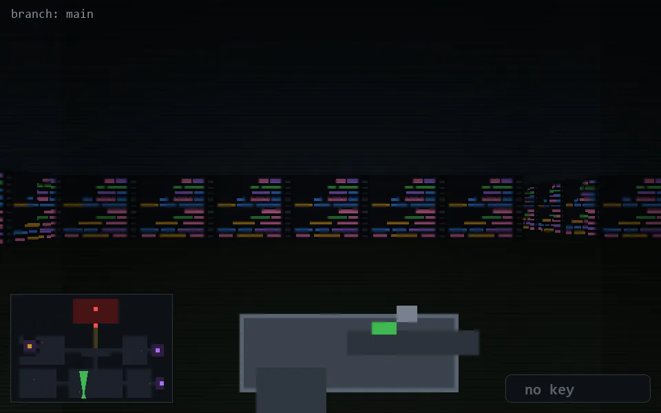

<!-- node:x17y24N -->
### `branch: main` · 📍 (17, 24) · facing N · 🔑 —

|      |      |      |
|:----:|:----:|:----:|
|      | [⬆️](x17y23N.md) |      |
| [⬅️](x17y24W.md) | [💥](x17y24Nd.md) | [➡️](x17y24E.md) |
|      | ⛔️ |      |

[⌂ index](../README.md)
