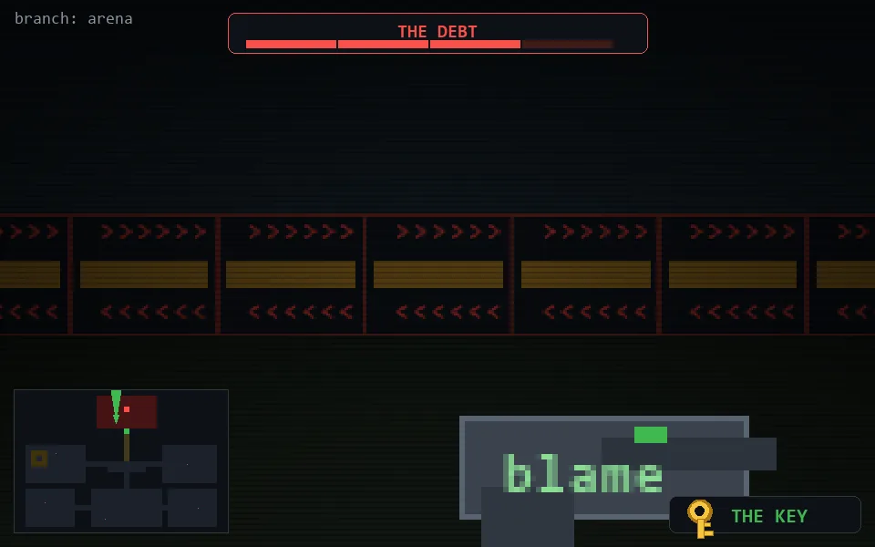

<!-- node:x18y05Nh3 -->
### `branch: prod` · 📍 (18, 5) · facing N · ⚔ monolith [███░ 3/4]

|      |      |      |
|:----:|:----:|:----:|
|      | [⬆️](x18y04Nh3.md) |      |
| [⬅️](x18y05Wh3.md) | [💥](x18y05Nh2.md) | [➡️](x18y05Eh3.md) |
|      | [⬇️](x18y06Nh3.md) |      |

[⌂ index](../README.md)
