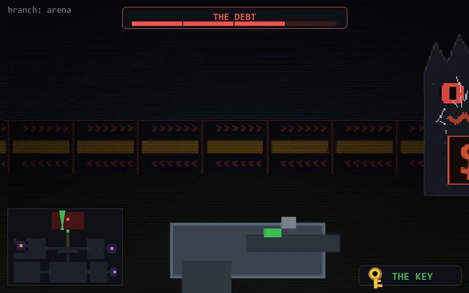

<!-- node:x18y06Nh3 -->
### `branch: prod` · 📍 (18, 6) · facing N · ⚔ monolith [███░ 3/4]

|      |      |      |
|:----:|:----:|:----:|
|      | [⬆️](x18y05Nh3.md) |      |
| [⬅️](x18y06Wh3.md) | [💥](x18y06Nh2.md) | [➡️](x18y06Eh3.md) |
|      | ⛔️ |      |

[⌂ index](../README.md)
