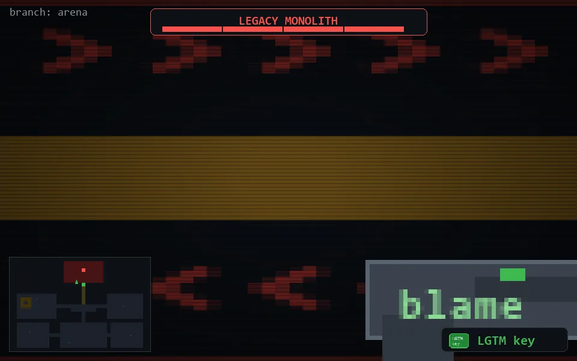

<!-- node:x18y06Sh4 -->
### `branch: prod` · 📍 (18, 6) · facing S · ⚔ monolith [████ 4/4]

|      |      |      |
|:----:|:----:|:----:|
|      | ⛔️ |      |
| [⬅️](x18y06Eh4.md) | [💥](x18y06Sh3.md) | [➡️](x18y06Wh4.md) |
|      | [⬇️](x18y05Sh4.md) |      |

[⌂ index](../README.md)
