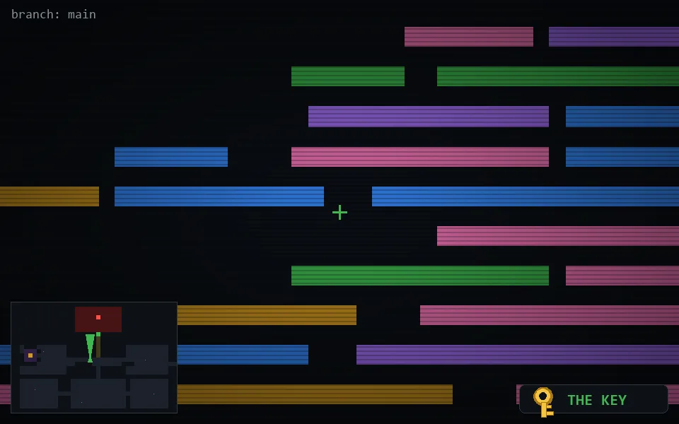

<!-- node:x18y13Nk -->
### `branch: main` · 📍 (18, 13) · facing N · 🔑 LGTM

|      |      |      |
|:----:|:----:|:----:|
|      | ⛔️ |      |
| [⬅️](x18y13Wk.md) | [💥](x18y13Nk.md) | [➡️](x18y13Ek.md) |
|      | [⬇️](x18y14Nk.md) |      |

[⌂ index](../README.md)
