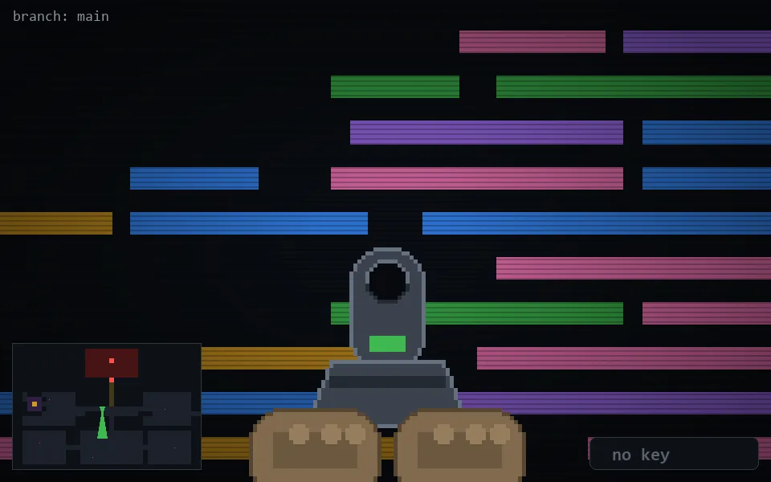

<!-- node:x18y13Sd -->
### `branch: main` · 📍 (18, 13) · facing S · 🔑 — · ✖ bug deleted (it will be back)

|      |      |      |
|:----:|:----:|:----:|
|      | ⛔️ |      |
| [⬅️](x18y13Ed.md) | [💥](x18y13Sd.md) | [➡️](x18y13Wd.md) |
|      | ⛔️ |      |

[⌂ index](../README.md)
