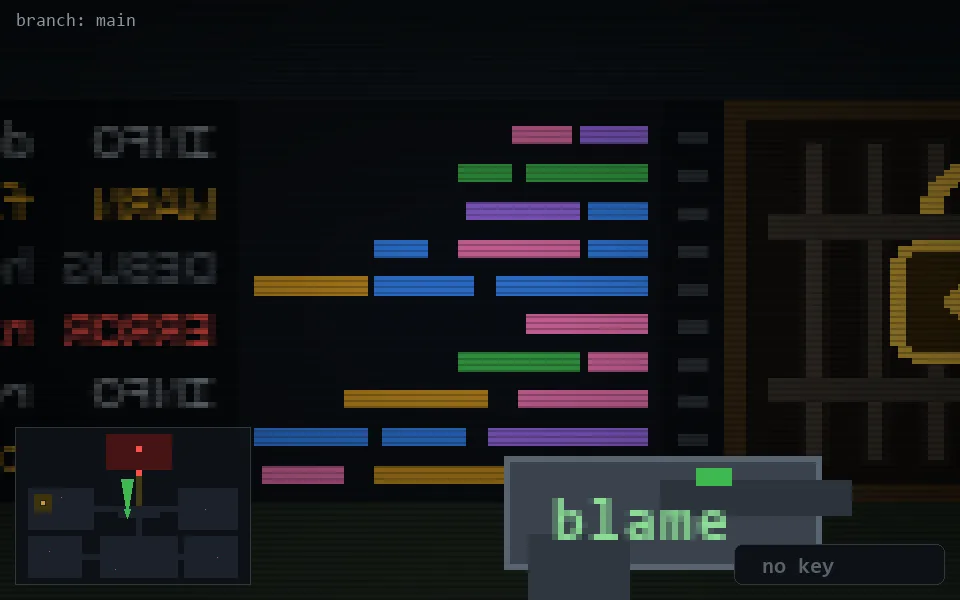

<!-- node:x18y14N -->
### `branch: main` · 📍 (18, 14) · facing N · 🔑 —

|      |      |      |
|:----:|:----:|:----:|
|      | [⬆️](x18y13N.md) |      |
| [⬅️](x18y14W.md) | [💥](x18y14N.md) | [➡️](x18y14E.md) |
|      | ⛔️ |      |

[⌂ index](../README.md)
