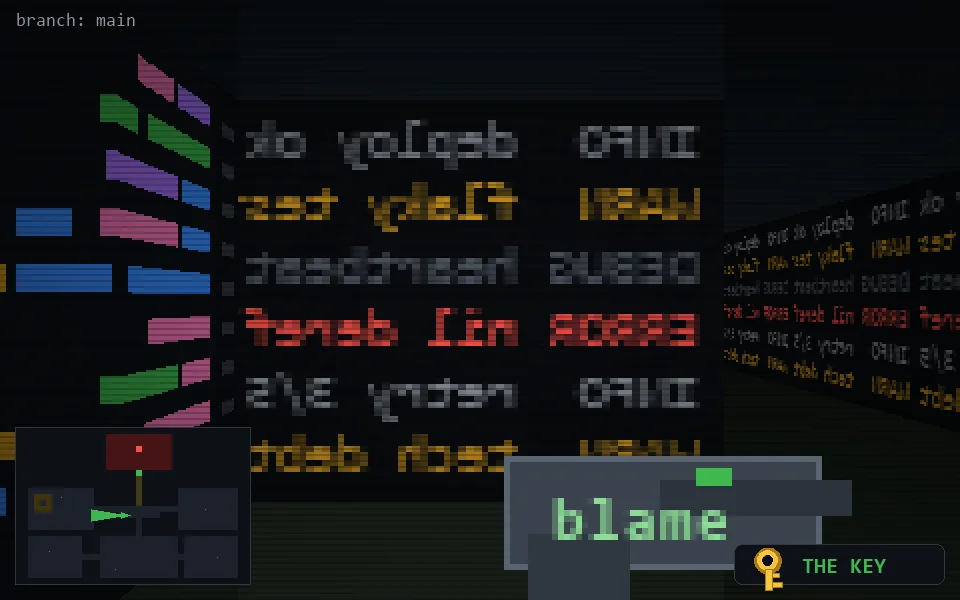

<!-- node:x18y14Wk -->
### `branch: main` · 📍 (18, 14) · facing W · 🔑 LGTM

|      |      |      |
|:----:|:----:|:----:|
|      | [⬆️](x17y14Wk.md) |      |
| [⬅️](x18y14Sk.md) | [💥](x18y14Wk.md) | [➡️](x18y14Nk.md) |
|      | [⬇️](x19y14Wk.md) |      |

[⌂ index](../README.md)
