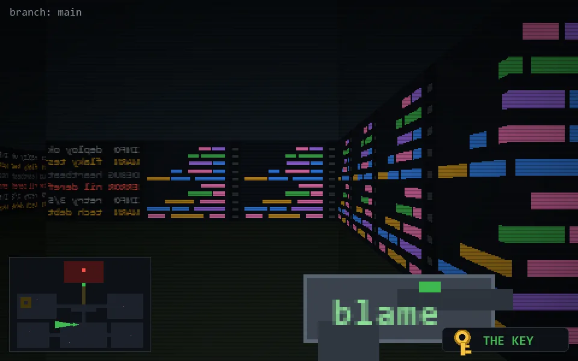

<!-- node:x18y18Wk -->
### `branch: main` · 📍 (18, 18) · facing W · 🔑 THE KEY

|      |      |      |
|:----:|:----:|:----:|
|      | [⬆️](x17y18Wk.md) |      |
| [⬅️](x18y18Sk.md) | [💥](x18y18Wk.md) | [➡️](x18y18Nk.md) |
|      | [⬇️](x19y18Wk.md) |      |

[⌂ index](../README.md)
