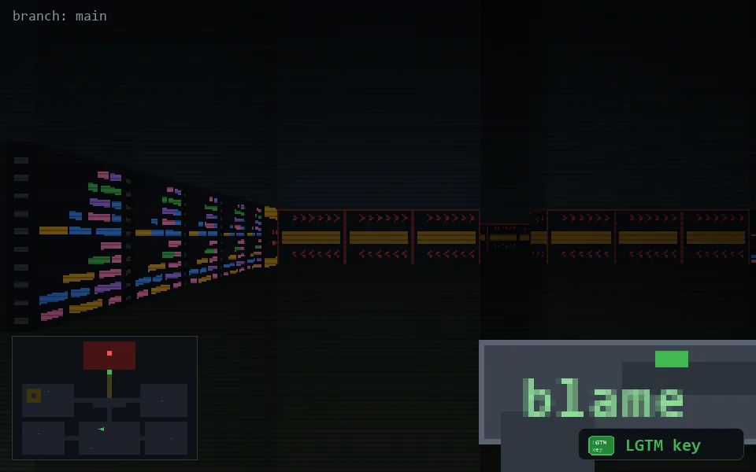

<!-- node:x18y19Ek -->
### `branch: main` · 📍 (18, 19) · facing E · 🔑 THE KEY

|      |      |      |
|:----:|:----:|:----:|
|      | [⬆️](x19y19Ek.md) |      |
| [⬅️](x18y19Nk.md) | [💥](x18y19Ekd.md) | [➡️](x18y19Sk.md) |
|      | [⬇️](x17y19Ek.md) |      |

[⌂ index](../README.md)
