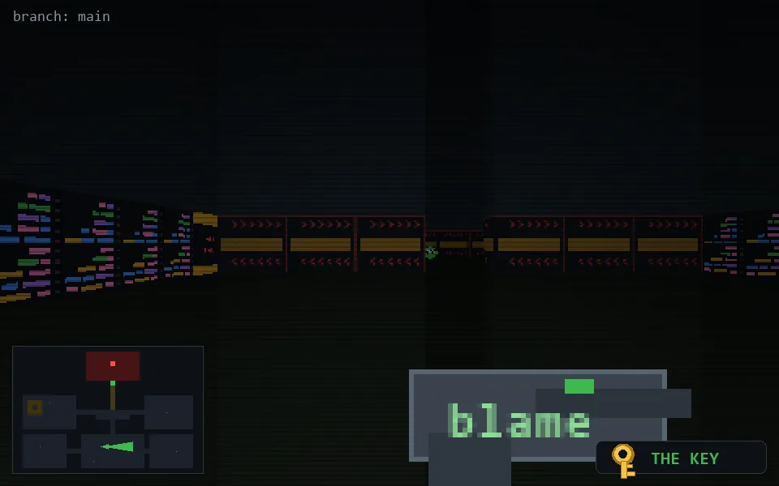

<!-- node:x18y20Ek -->
### `branch: main` · 📍 (18, 20) · facing E · 🔑 THE KEY

|      |      |      |
|:----:|:----:|:----:|
|      | [⬆️](x19y20Ek.md) |      |
| [⬅️](x18y20Nk.md) | [💥](x18y20Ek.md) | [➡️](x18y20Sk.md) |
|      | [⬇️](x17y20Ek.md) |      |

[⌂ index](../README.md)
