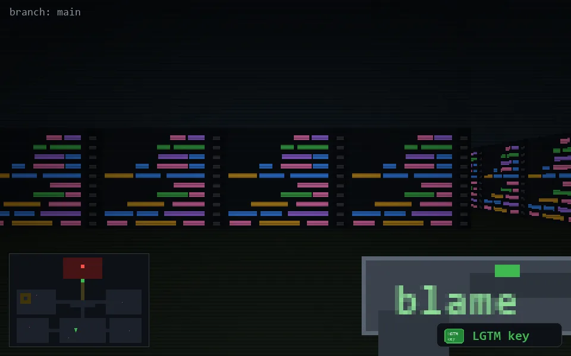

<!-- node:x18y21Nk -->
### `branch: main` · 📍 (18, 21) · facing N · 🔑 THE KEY

|      |      |      |
|:----:|:----:|:----:|
|      | [⬆️](x18y20Nk.md) |      |
| [⬅️](x18y21Wk.md) | [💥](x18y21Nkd.md) | [➡️](x18y21Ek.md) |
|      | [⬇️](x18y22Nk.md) |      |

[⌂ index](../README.md)
