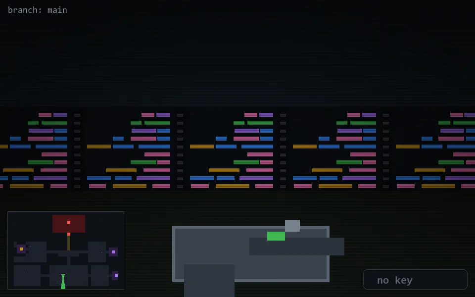

<!-- node:x18y21S -->
### `branch: main` · 📍 (18, 21) · facing S · 🔑 —

|      |      |      |
|:----:|:----:|:----:|
|      | [⬆️](x18y22S.md) |      |
| [⬅️](x18y21E.md) | [💥](x18y21Sd.md) | [➡️](x18y21W.md) |
|      | [⬇️](x18y20S.md) |      |

[⌂ index](../README.md)
