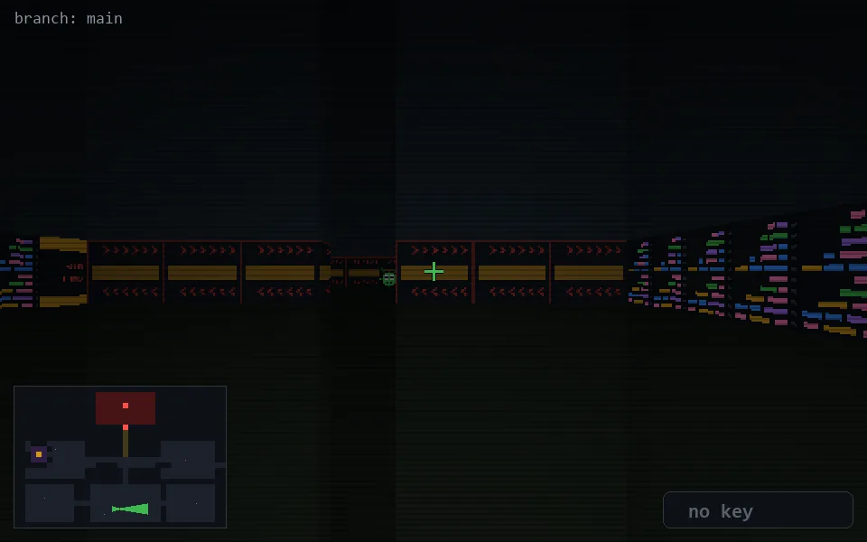

<!-- node:x18y22Ed -->
### `branch: main` · 📍 (18, 22) · facing E · 🔑 — · ✖ bug deleted (it will be back)

|      |      |      |
|:----:|:----:|:----:|
|      | [⬆️](x19y22Ed.md) |      |
| [⬅️](x18y22Nd.md) | [💥](x18y22Ed.md) | [➡️](x18y22Sd.md) |
|      | [⬇️](x17y22Ed.md) |      |

[⌂ index](../README.md)
