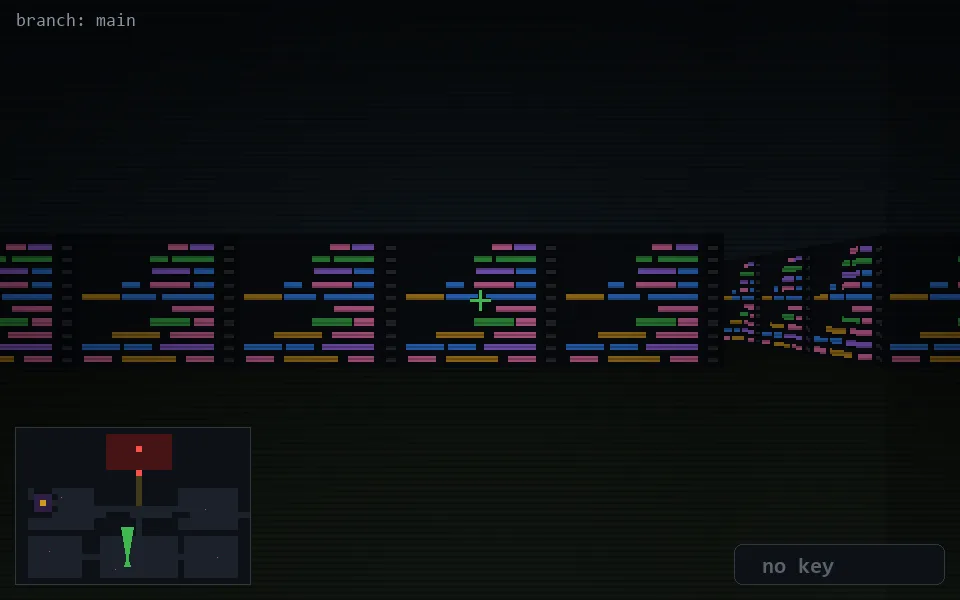

<!-- node:x18y22N -->
### `branch: main` · 📍 (18, 22) · facing N · 🔑 —

|      |      |      |
|:----:|:----:|:----:|
|      | [⬆️](x18y21N.md) |      |
| [⬅️](x18y22W.md) | [💥](x18y22N.md) | [➡️](x18y22E.md) |
|      | [⬇️](x18y23N.md) |      |

[⌂ index](../README.md)
