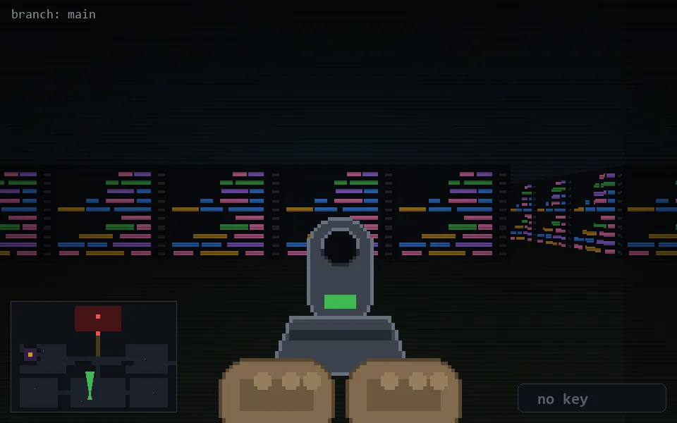

<!-- node:x18y22Nd -->
### `branch: main` · 📍 (18, 22) · facing N · 🔑 — · ✖ bug deleted (it will be back)

|      |      |      |
|:----:|:----:|:----:|
|      | [⬆️](x18y21Nd.md) |      |
| [⬅️](x18y22Wd.md) | [💥](x18y22Nd.md) | [➡️](x18y22Ed.md) |
|      | [⬇️](x18y23Nd.md) |      |

[⌂ index](../README.md)
