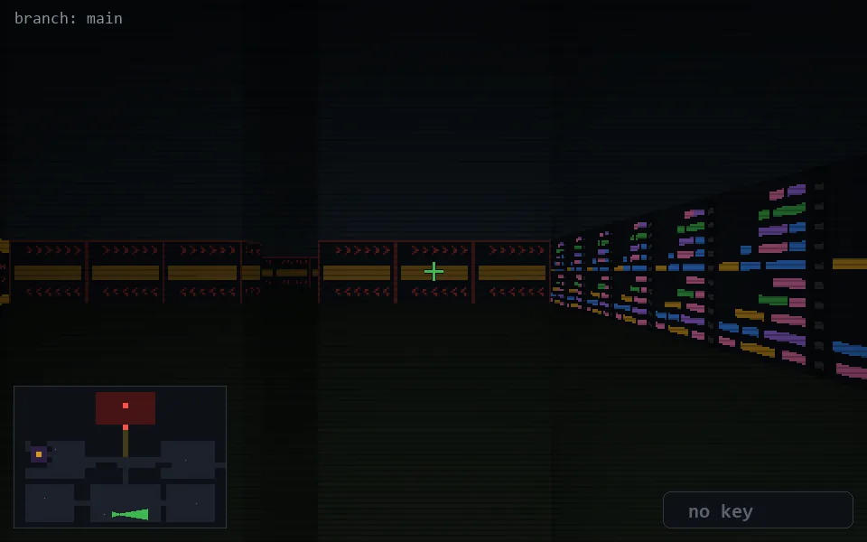

<!-- node:x18y23Ed -->
### `branch: main` · 📍 (18, 23) · facing E · 🔑 — · ✖ bug deleted (it will be back)

|      |      |      |
|:----:|:----:|:----:|
|      | [⬆️](x19y23Ed.md) |      |
| [⬅️](x18y23Nd.md) | [💥](x18y23Ed.md) | [➡️](x18y23Sd.md) |
|      | [⬇️](x17y23Ed.md) |      |

[⌂ index](../README.md)
