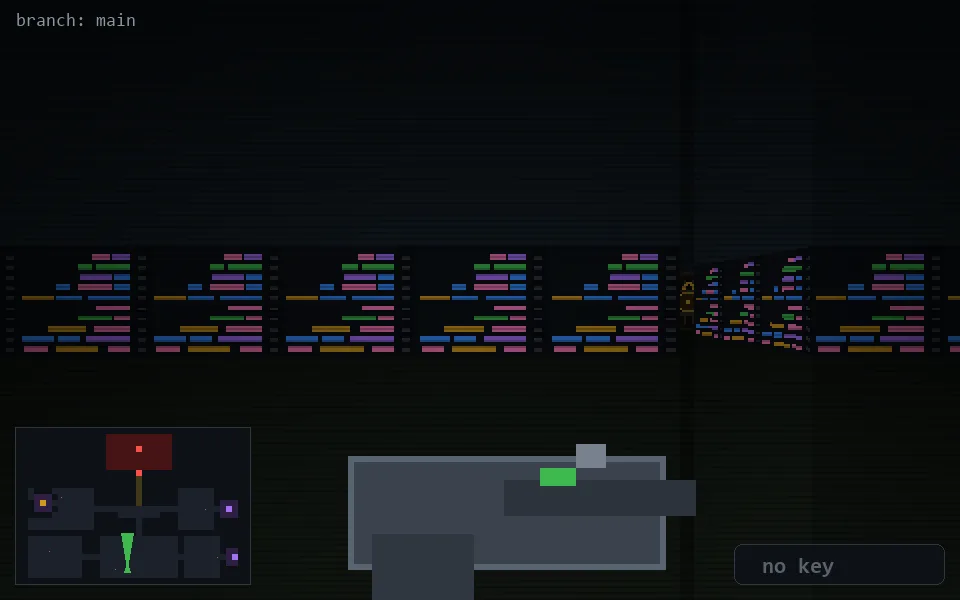

<!-- node:x18y23N -->
### `branch: main` · 📍 (18, 23) · facing N · 🔑 —

|      |      |      |
|:----:|:----:|:----:|
|      | [⬆️](x18y22N.md) |      |
| [⬅️](x18y23W.md) | [💥](x18y23Nd.md) | [➡️](x18y23E.md) |
|      | [⬇️](x18y24N.md) |      |

[⌂ index](../README.md)
