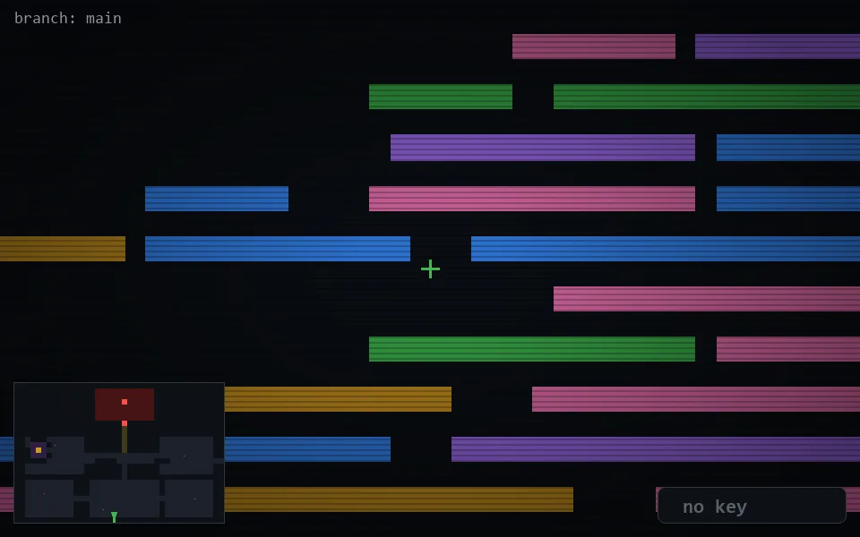

<!-- node:x18y24Sd -->
### `branch: main` · 📍 (18, 24) · facing S · 🔑 — · ✖ bug deleted (it will be back)

|      |      |      |
|:----:|:----:|:----:|
|      | ⛔️ |      |
| [⬅️](x18y24Ed.md) | [💥](x18y24Sd.md) | [➡️](x18y24Wd.md) |
|      | [⬇️](x18y23Sd.md) |      |

[⌂ index](../README.md)
