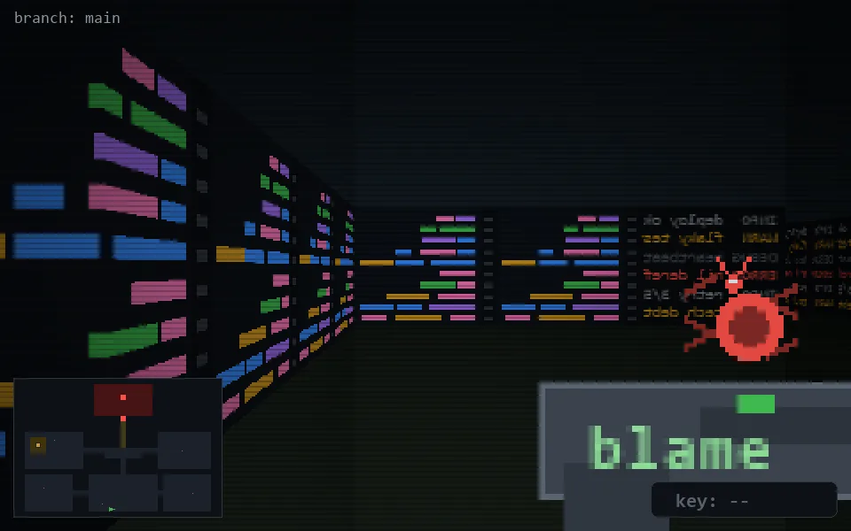

<!-- node:x18y24W -->
### `branch: main` · 📍 (18, 24) · facing W · 🔑 —

|      |      |      |
|:----:|:----:|:----:|
|      | [⬆️](x17y24W.md) |      |
| [⬅️](x18y24S.md) | [💥](x18y24W.md) | [➡️](x18y24N.md) |
|      | [⬇️](x19y24W.md) |      |

[⌂ index](../README.md)
