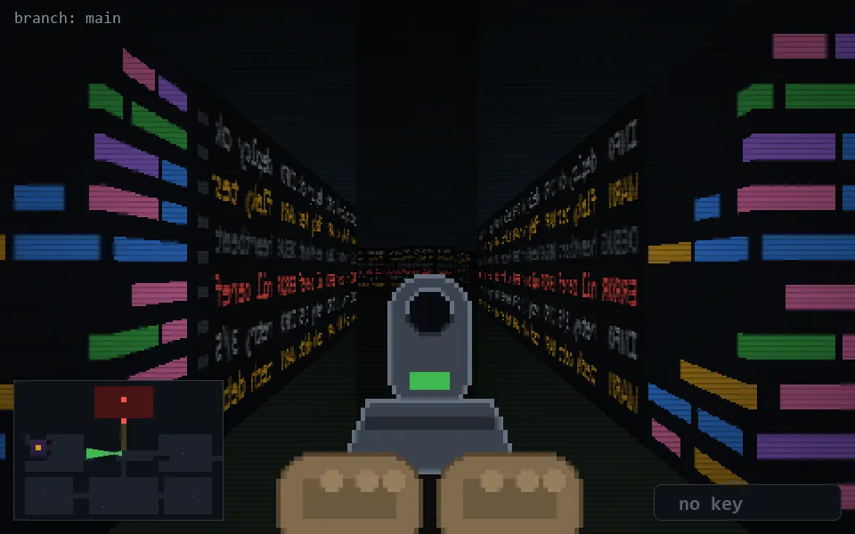

<!-- node:x19y13Wd -->
### `branch: main` · 📍 (19, 13) · facing W · 🔑 — · ✖ bug deleted (it will be back)

|      |      |      |
|:----:|:----:|:----:|
|      | [⬆️](x18y13Wd.md) |      |
| [⬅️](x19y13Sd.md) | [💥](x19y13Wd.md) | [➡️](x19y13Nd.md) |
|      | [⬇️](x20y13Wd.md) |      |

[⌂ index](../README.md)
