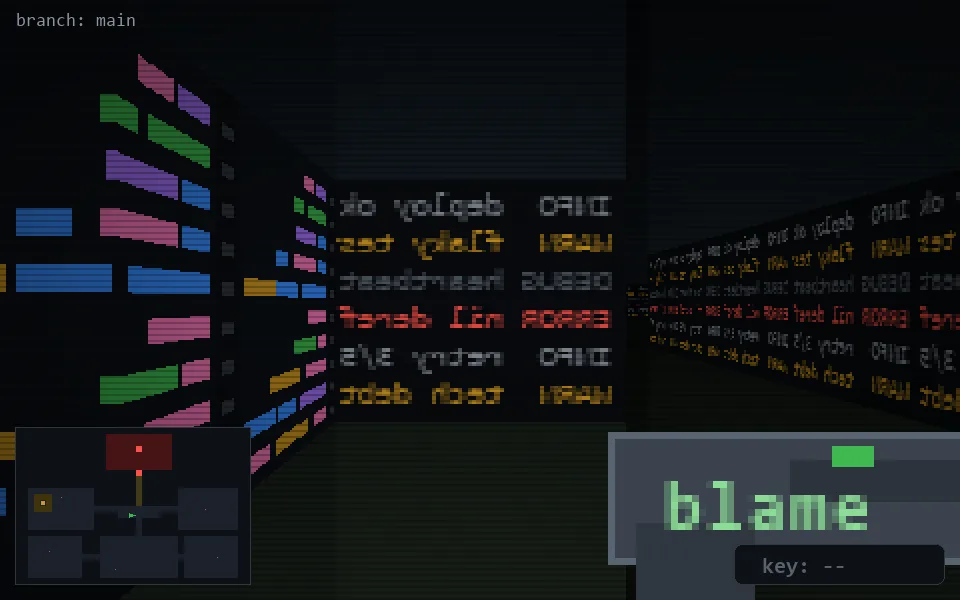

<!-- node:x19y14W -->
### `branch: main` · 📍 (19, 14) · facing W · 🔑 —

|      |      |      |
|:----:|:----:|:----:|
|      | [⬆️](x18y14W.md) |      |
| [⬅️](x19y14S.md) | [💥](x19y14W.md) | [➡️](x19y14N.md) |
|      | [⬇️](x20y14W.md) |      |

[⌂ index](../README.md)
