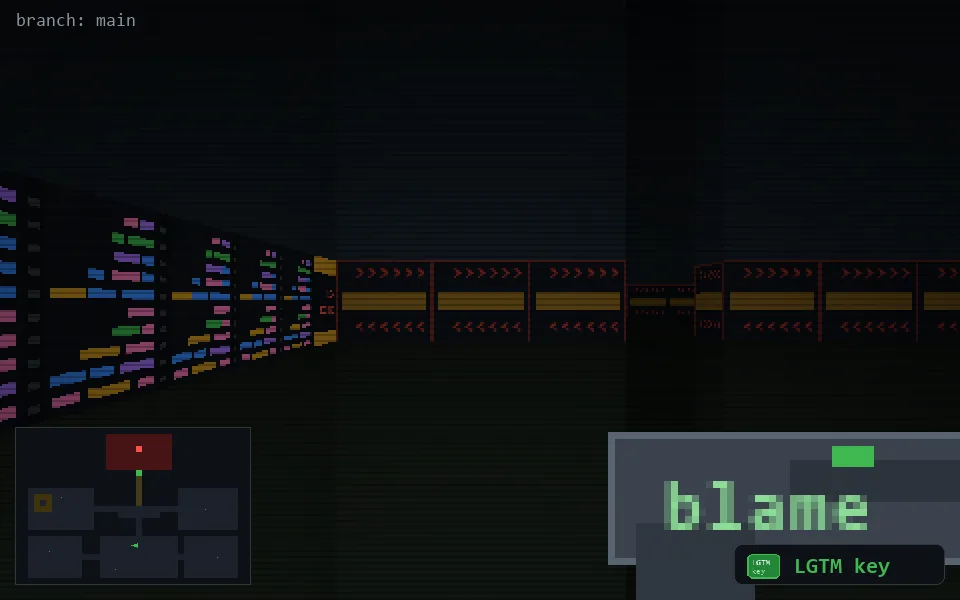

<!-- node:x19y19Ek -->
### `branch: main` · 📍 (19, 19) · facing E · 🔑 LGTM

|      |      |      |
|:----:|:----:|:----:|
|      | [⬆️](x20y19Ek.md) |      |
| [⬅️](x19y19Nk.md) | [💥](x19y19Ek.md) | [➡️](x19y19Sk.md) |
|      | [⬇️](x18y19Ek.md) |      |

[⌂ index](../README.md)
