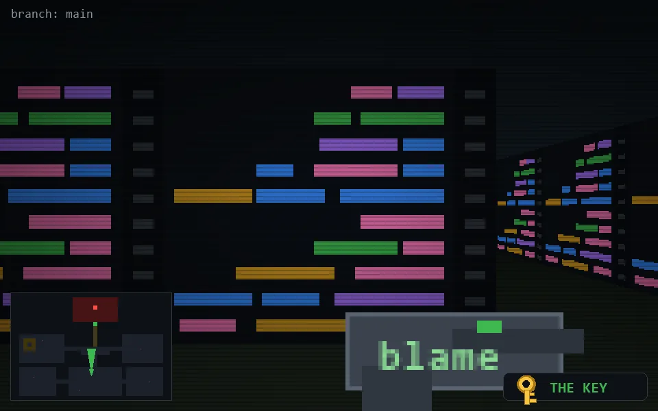

<!-- node:x19y19Nk -->
### `branch: main` · 📍 (19, 19) · facing N · 🔑 LGTM

|      |      |      |
|:----:|:----:|:----:|
|      | [⬆️](x19y18Nk.md) |      |
| [⬅️](x19y19Wk.md) | [💥](x19y19Nk.md) | [➡️](x19y19Ek.md) |
|      | [⬇️](x19y20Nk.md) |      |

[⌂ index](../README.md)
