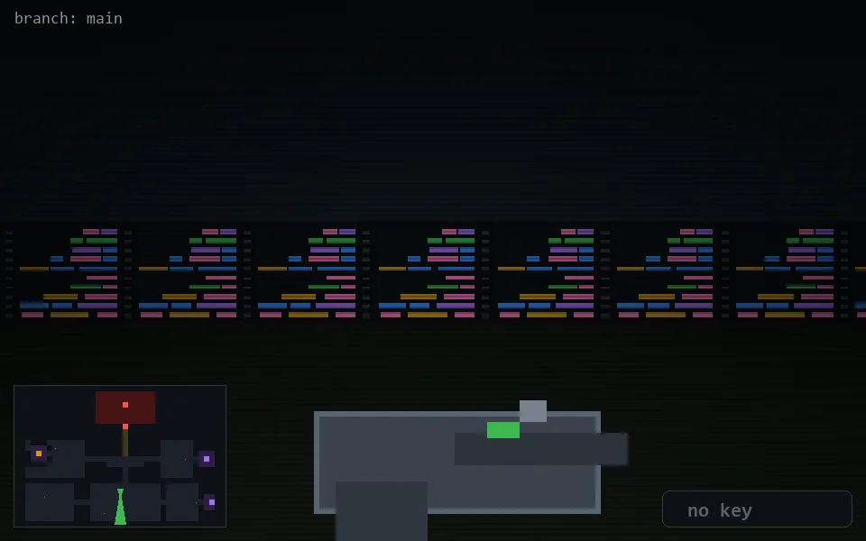

<!-- node:x19y19S -->
### `branch: main` · 📍 (19, 19) · facing S · 🔑 —

|      |      |      |
|:----:|:----:|:----:|
|      | [⬆️](x19y20S.md) |      |
| [⬅️](x19y19E.md) | [💥](x19y19Sd.md) | [➡️](x19y19W.md) |
|      | [⬇️](x19y18S.md) |      |

[⌂ index](../README.md)
