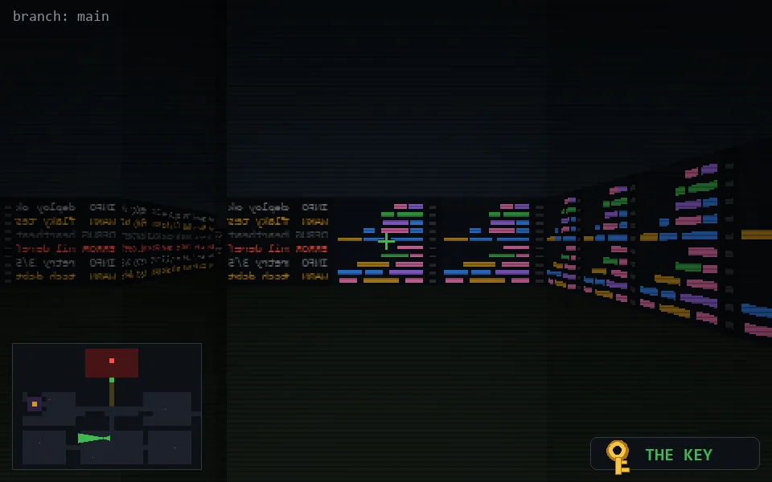

<!-- node:x19y19Wk -->
### `branch: main` · 📍 (19, 19) · facing W · 🔑 THE KEY

|      |      |      |
|:----:|:----:|:----:|
|      | [⬆️](x18y19Wk.md) |      |
| [⬅️](x19y19Sk.md) | [💥](x19y19Wkd.md) | [➡️](x19y19Nk.md) |
|      | [⬇️](x20y19Wk.md) |      |

[⌂ index](../README.md)
