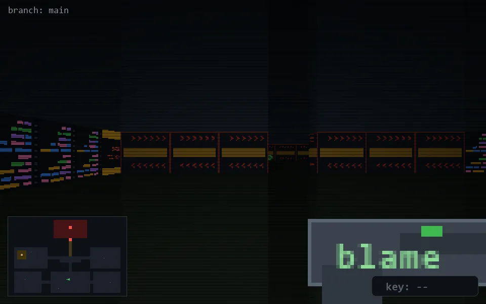

<!-- node:x19y20E -->
### `branch: main` · 📍 (19, 20) · facing E · 🔑 —

|      |      |      |
|:----:|:----:|:----:|
|      | [⬆️](x20y20E.md) |      |
| [⬅️](x19y20N.md) | [💥](x19y20Ed.md) | [➡️](x19y20S.md) |
|      | [⬇️](x18y20E.md) |      |

[⌂ index](../README.md)
