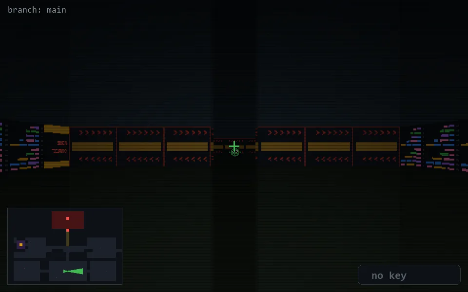

<!-- node:x19y21Ed -->
### `branch: main` · 📍 (19, 21) · facing E · 🔑 — · ✖ bug deleted (it will be back)

|      |      |      |
|:----:|:----:|:----:|
|      | [⬆️](x20y21Ed.md) |      |
| [⬅️](x19y21Nd.md) | [💥](x19y21Ed.md) | [➡️](x19y21Sd.md) |
|      | [⬇️](x18y21Ed.md) |      |

[⌂ index](../README.md)
