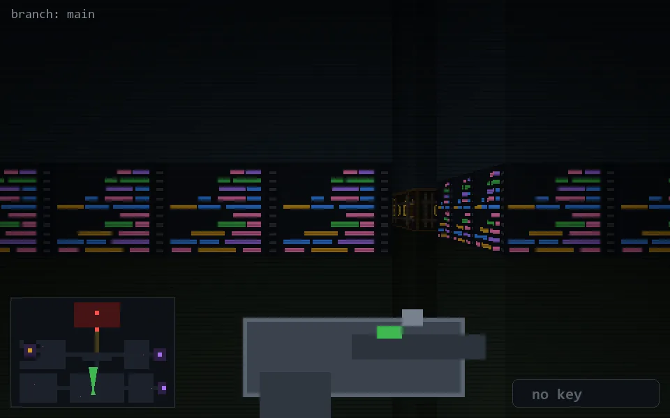

<!-- node:x19y22N -->
### `branch: main` · 📍 (19, 22) · facing N · 🔑 —

|      |      |      |
|:----:|:----:|:----:|
|      | [⬆️](x19y21N.md) |      |
| [⬅️](x19y22W.md) | [💥](x19y22Nd.md) | [➡️](x19y22E.md) |
|      | [⬇️](x19y23N.md) |      |

[⌂ index](../README.md)
