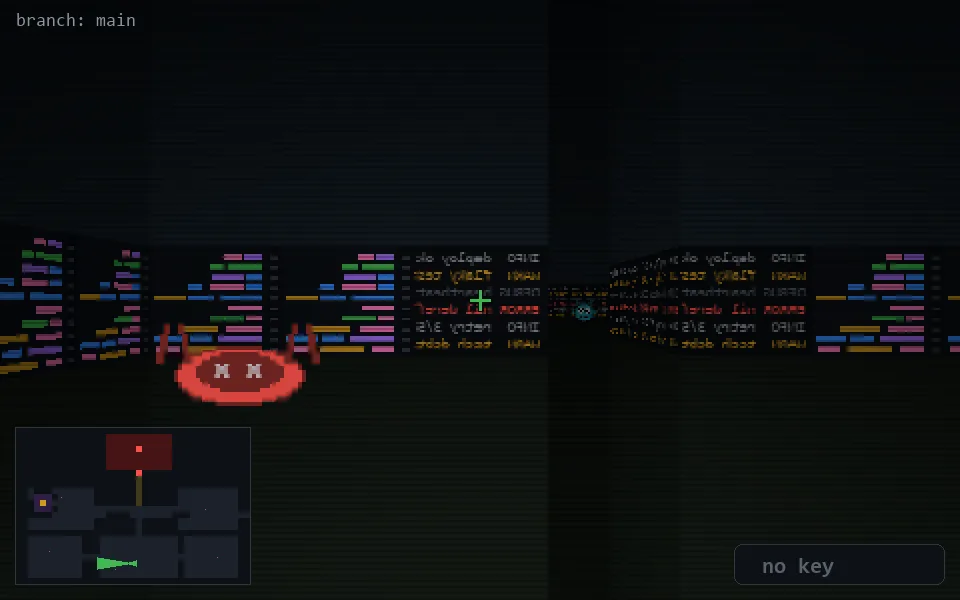

<!-- node:x19y22Wd -->
### `branch: main` · 📍 (19, 22) · facing W · 🔑 — · ✖ bug deleted (it will be back)

|      |      |      |
|:----:|:----:|:----:|
|      | [⬆️](x18y22Wd.md) |      |
| [⬅️](x19y22Sd.md) | [💥](x19y22Wd.md) | [➡️](x19y22Nd.md) |
|      | [⬇️](x20y22Wd.md) |      |

[⌂ index](../README.md)
