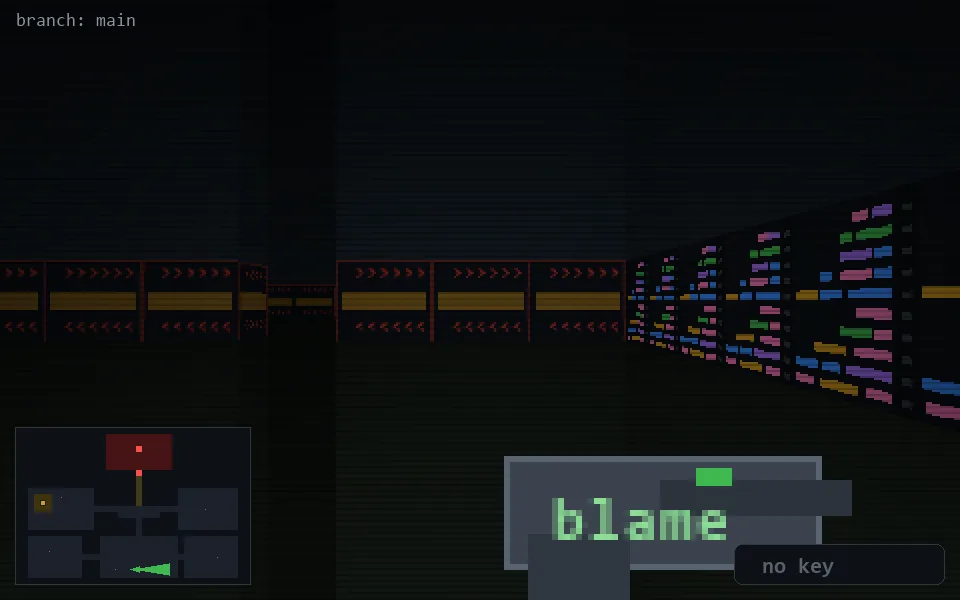

<!-- node:x19y23E -->
### `branch: main` · 📍 (19, 23) · facing E · 🔑 —

|      |      |      |
|:----:|:----:|:----:|
|      | [⬆️](x20y23E.md) |      |
| [⬅️](x19y23N.md) | [💥](x19y23E.md) | [➡️](x19y23S.md) |
|      | [⬇️](x18y23E.md) |      |

[⌂ index](../README.md)
