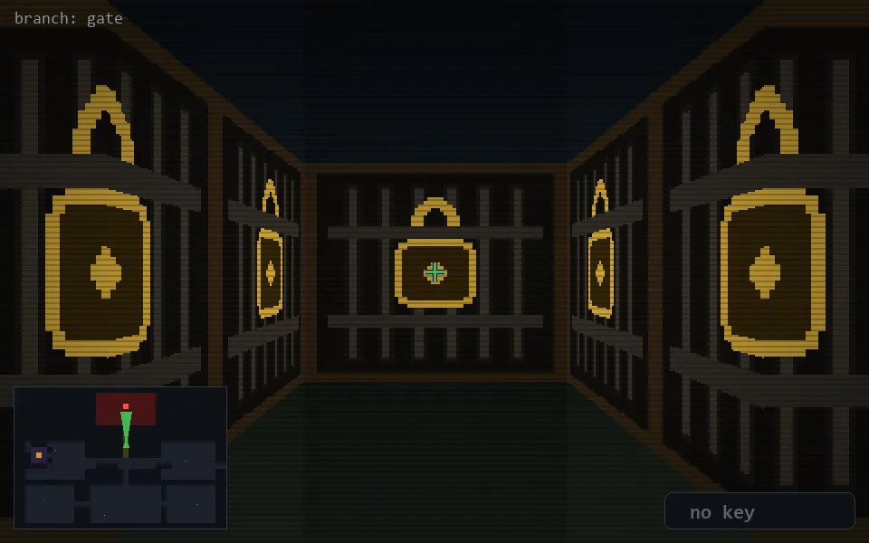

<!-- node:x20y10N -->
### `branch: gate` · 📍 (20, 10) · facing N · 🔑 —

|      |      |      |
|:----:|:----:|:----:|
|      | [⬆️](x20y09N.md) |      |
| [⬅️](x20y10W.md) | [💥](x20y10N.md) | [➡️](x20y10E.md) |
|      | [⬇️](x20y11N.md) |      |

[⌂ index](../README.md)
