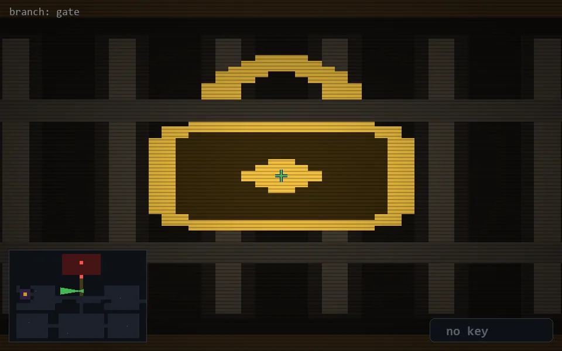

<!-- node:x20y11W -->
### `branch: gate` · 📍 (20, 11) · facing W · 🔑 —

|      |      |      |
|:----:|:----:|:----:|
|      | ⛔️ |      |
| [⬅️](x20y11S.md) | [💥](x20y11W.md) | [➡️](x20y11N.md) |
|      | ⛔️ |      |

[⌂ index](../README.md)
