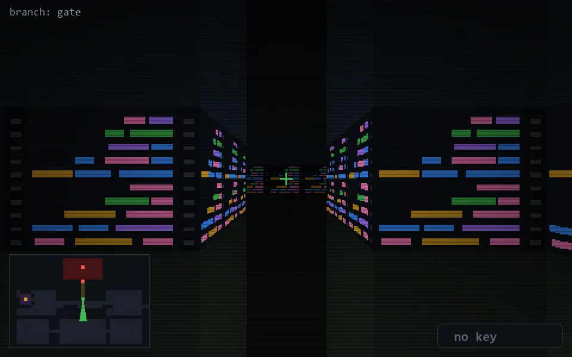

<!-- node:x20y12S -->
### `branch: gate` · 📍 (20, 12) · facing S · 🔑 —

|      |      |      |
|:----:|:----:|:----:|
|      | [⬆️](x20y13S.md) |      |
| [⬅️](x20y12E.md) | [💥](x20y12S.md) | [➡️](x20y12W.md) |
|      | [⬇️](x20y11S.md) |      |

[⌂ index](../README.md)
