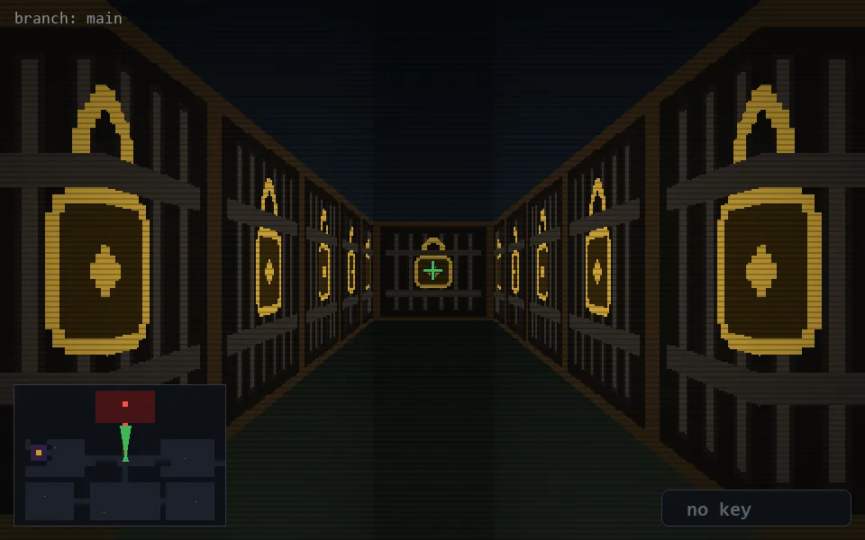

<!-- node:x20y13Nd -->
### `branch: main` · 📍 (20, 13) · facing N · 🔑 — · ✖ bug deleted (it will be back)

|      |      |      |
|:----:|:----:|:----:|
|      | [⬆️](x20y12N.md) |      |
| [⬅️](x20y13Wd.md) | [💥](x20y13Nd.md) | [➡️](x20y13Ed.md) |
|      | [⬇️](x20y14Nd.md) |      |

[⌂ index](../README.md)
