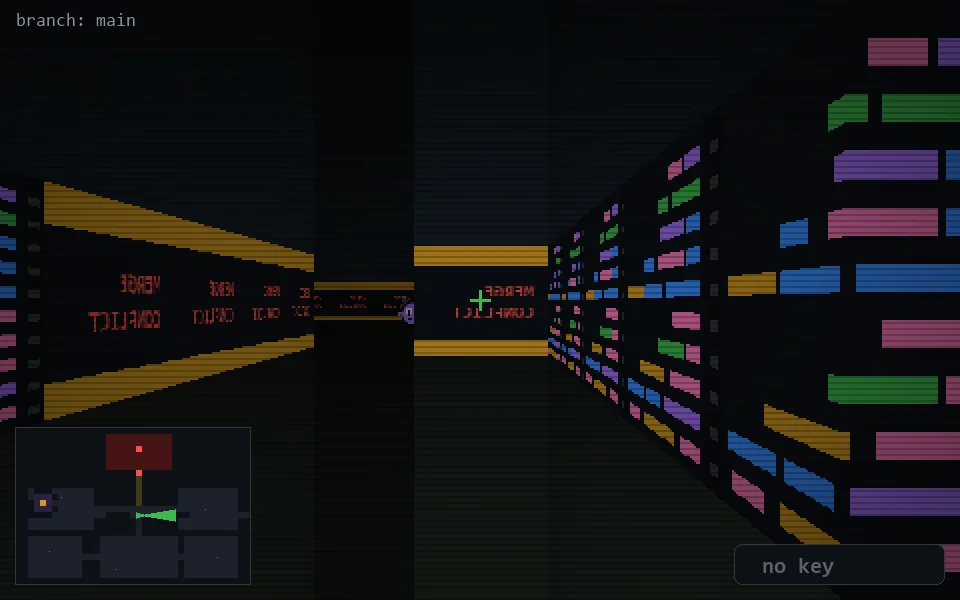

<!-- node:x20y14E -->
### `branch: main` · 📍 (20, 14) · facing E · 🔑 —

|      |      |      |
|:----:|:----:|:----:|
|      | [⬆️](x21y14E.md) |      |
| [⬅️](x20y14N.md) | [💥](x20y14Ed.md) | [➡️](x20y14S.md) |
|      | [⬇️](x19y14E.md) |      |

[⌂ index](../README.md)
