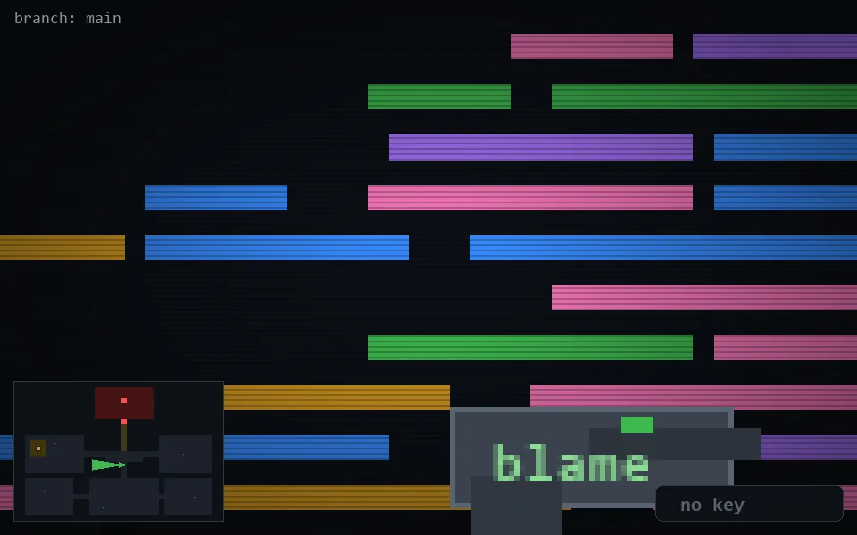

<!-- node:x20y15W -->
### `branch: main` · 📍 (20, 15) · facing W · 🔑 —

|      |      |      |
|:----:|:----:|:----:|
|      | ⛔️ |      |
| [⬅️](x20y15S.md) | [💥](x20y15W.md) | [➡️](x20y15N.md) |
|      | ⛔️ |      |

[⌂ index](../README.md)
