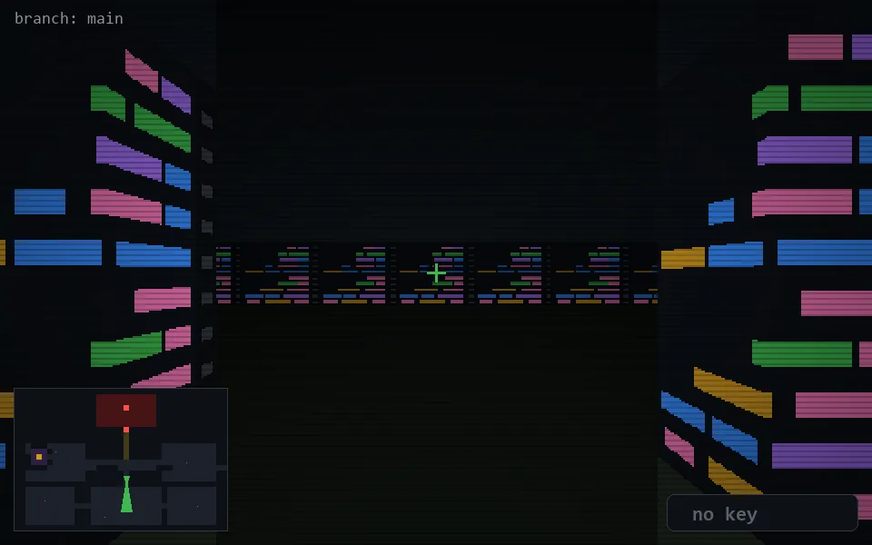

<!-- node:x20y16Sd -->
### `branch: main` · 📍 (20, 16) · facing S · 🔑 — · ✖ bug deleted (it will be back)

|      |      |      |
|:----:|:----:|:----:|
|      | [⬆️](x20y17Sd.md) |      |
| [⬅️](x20y16Ed.md) | [💥](x20y16Sd.md) | [➡️](x20y16Wd.md) |
|      | [⬇️](x20y15Sd.md) |      |

[⌂ index](../README.md)
