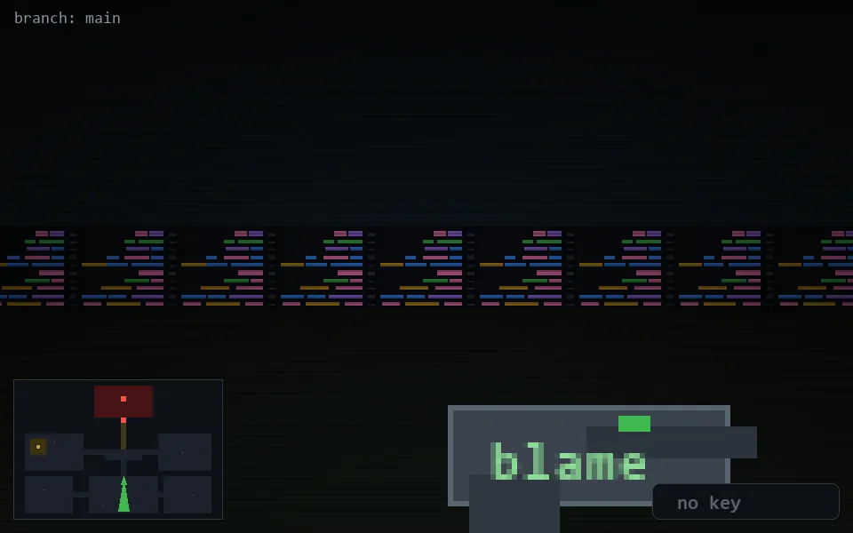

<!-- node:x20y18S -->
### `branch: main` · 📍 (20, 18) · facing S · 🔑 —

|      |      |      |
|:----:|:----:|:----:|
|      | [⬆️](x20y19S.md) |      |
| [⬅️](x20y18E.md) | [💥](x20y18S.md) | [➡️](x20y18W.md) |
|      | [⬇️](x20y17S.md) |      |

[⌂ index](../README.md)
