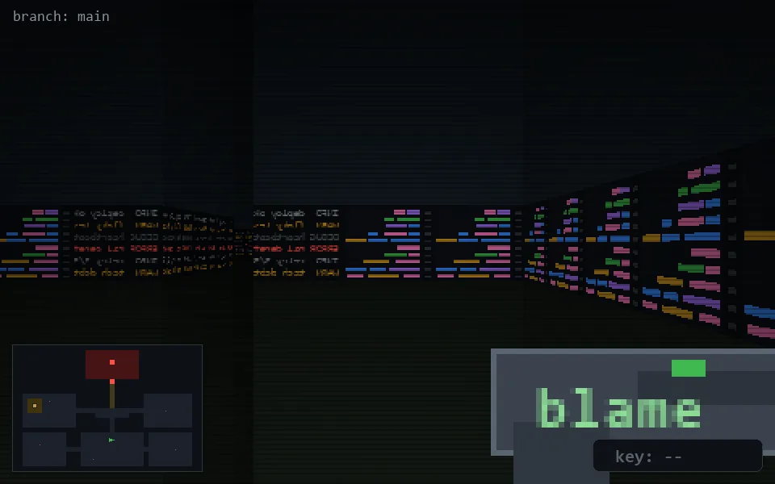

<!-- node:x20y19W -->
### `branch: main` · 📍 (20, 19) · facing W · 🔑 —

|      |      |      |
|:----:|:----:|:----:|
|      | [⬆️](x19y19W.md) |      |
| [⬅️](x20y19S.md) | [💥](x20y19Wd.md) | [➡️](x20y19N.md) |
|      | [⬇️](x21y19W.md) |      |

[⌂ index](../README.md)
