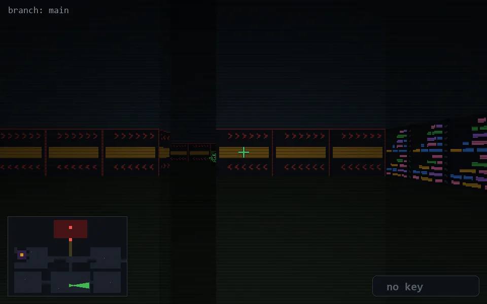

<!-- node:x20y22Ed -->
### `branch: main` · 📍 (20, 22) · facing E · 🔑 — · ✖ bug deleted (it will be back)

|      |      |      |
|:----:|:----:|:----:|
|      | [⬆️](x21y22Ed.md) |      |
| [⬅️](x20y22Nd.md) | [💥](x20y22Ed.md) | [➡️](x20y22Sd.md) |
|      | [⬇️](x19y22Ed.md) |      |

[⌂ index](../README.md)
