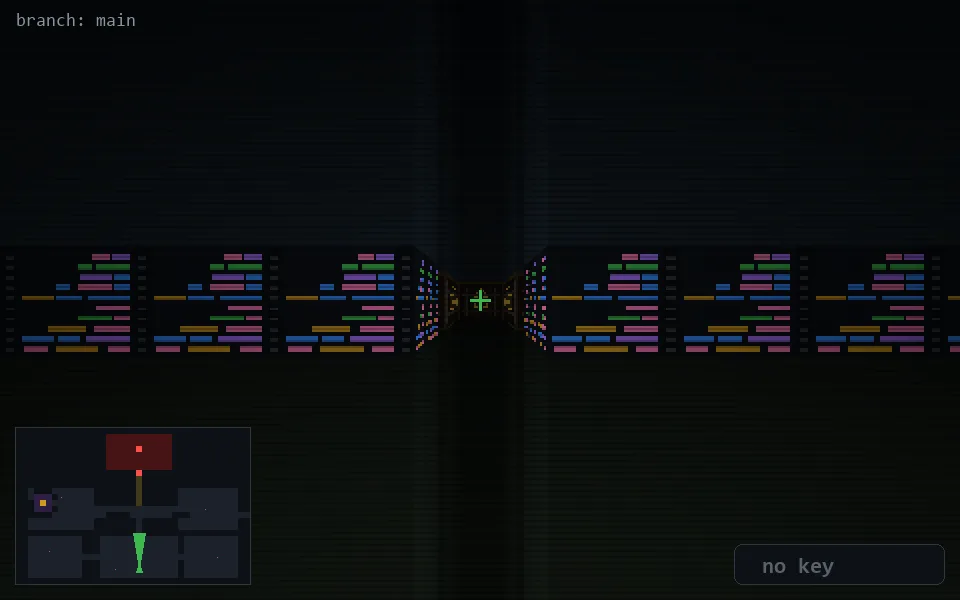

<!-- node:x20y23Nd -->
### `branch: main` · 📍 (20, 23) · facing N · 🔑 — · ✖ bug deleted (it will be back)

|      |      |      |
|:----:|:----:|:----:|
|      | [⬆️](x20y22Nd.md) |      |
| [⬅️](x20y23Wd.md) | [💥](x20y23Nd.md) | [➡️](x20y23Ed.md) |
|      | [⬇️](x20y24Nd.md) |      |

[⌂ index](../README.md)
