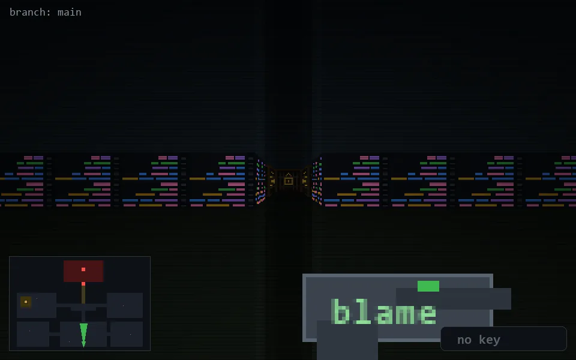

<!-- node:x20y24N -->
### `branch: main` · 📍 (20, 24) · facing N · 🔑 —

|      |      |      |
|:----:|:----:|:----:|
|      | [⬆️](x20y23N.md) |      |
| [⬅️](x20y24W.md) | [💥](x20y24Nd.md) | [➡️](x20y24E.md) |
|      | ⛔️ |      |

[⌂ index](../README.md)
