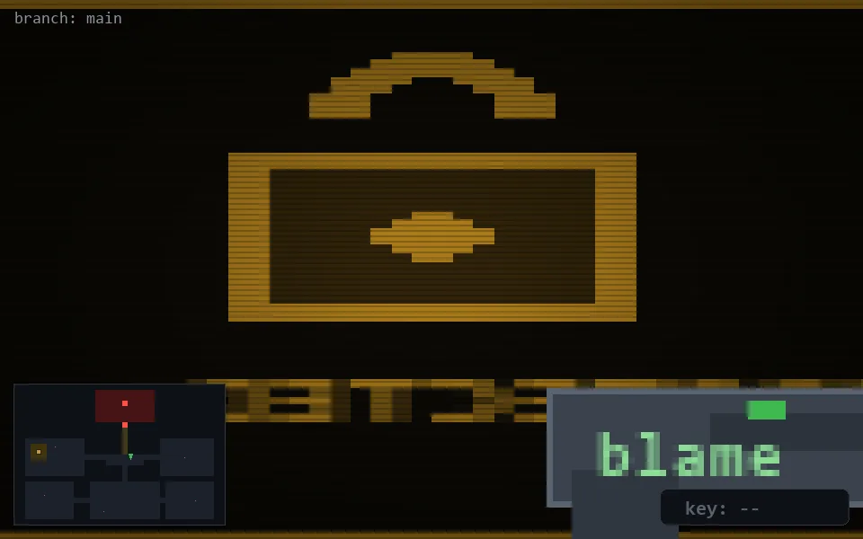

<!-- node:x21y13N -->
### `branch: main` · 📍 (21, 13) · facing N · 🔑 —

|      |      |      |
|:----:|:----:|:----:|
|      | ⛔️ |      |
| [⬅️](x21y13W.md) | [💥](x21y13N.md) | [➡️](x21y13E.md) |
|      | [⬇️](x21y14N.md) |      |

[⌂ index](../README.md)
