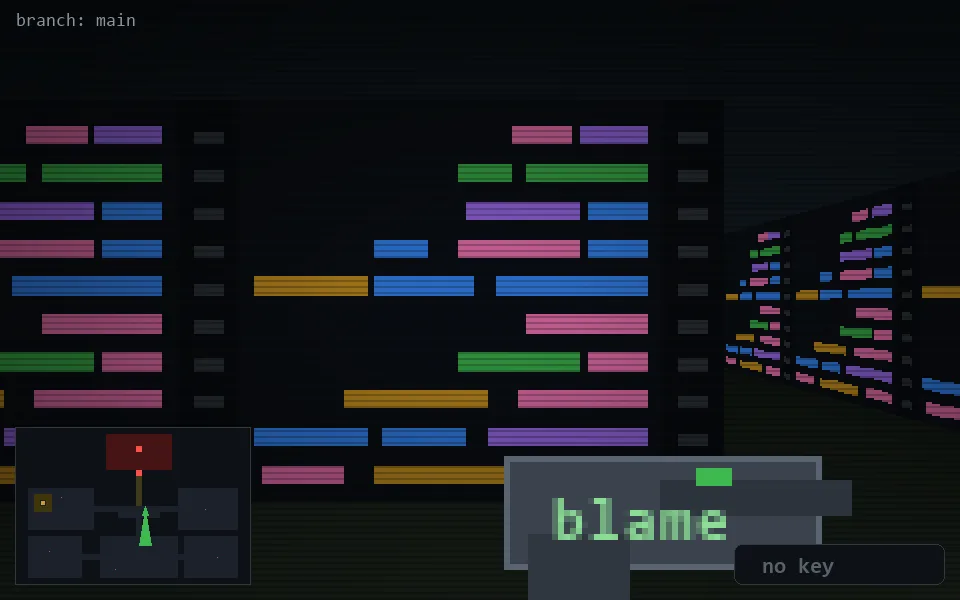

<!-- node:x21y13S -->
### `branch: main` · 📍 (21, 13) · facing S · 🔑 —

|      |      |      |
|:----:|:----:|:----:|
|      | [⬆️](x21y14S.md) |      |
| [⬅️](x21y13E.md) | [💥](x21y13Sd.md) | [➡️](x21y13W.md) |
|      | ⛔️ |      |

[⌂ index](../README.md)
