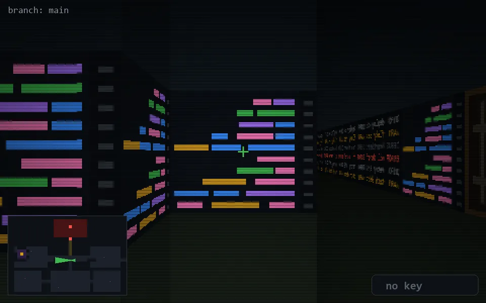

<!-- node:x21y14W -->
### `branch: main` · 📍 (21, 14) · facing W · 🔑 —

|      |      |      |
|:----:|:----:|:----:|
|      | [⬆️](x20y14W.md) |      |
| [⬅️](x21y14S.md) | [💥](x21y14W.md) | [➡️](x21y14N.md) |
|      | [⬇️](x22y14W.md) |      |

[⌂ index](../README.md)
