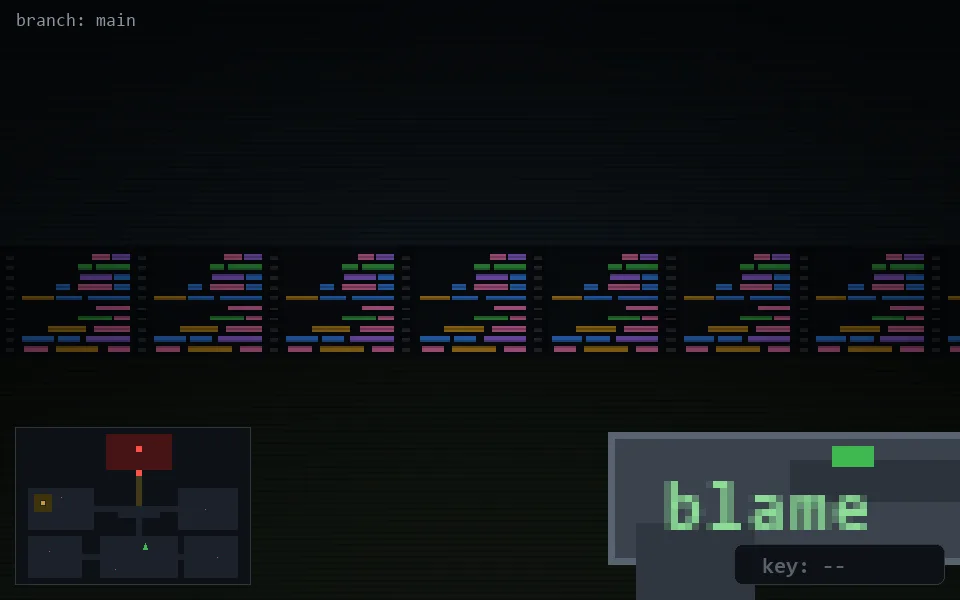

<!-- node:x21y19S -->
### `branch: main` · 📍 (21, 19) · facing S · 🔑 —

|      |      |      |
|:----:|:----:|:----:|
|      | [⬆️](x21y20S.md) |      |
| [⬅️](x21y19E.md) | [💥](x21y19Sd.md) | [➡️](x21y19W.md) |
|      | [⬇️](x21y18S.md) |      |

[⌂ index](../README.md)
