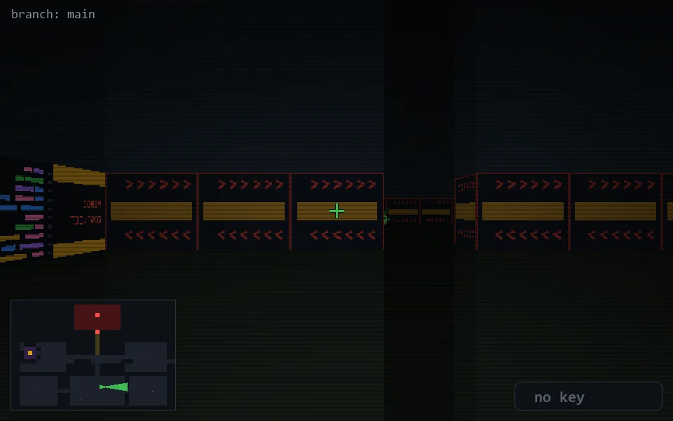

<!-- node:x21y20Ed -->
### `branch: main` · 📍 (21, 20) · facing E · 🔑 — · ✖ bug deleted (it will be back)

|      |      |      |
|:----:|:----:|:----:|
|      | [⬆️](x22y20Ed.md) |      |
| [⬅️](x21y20Nd.md) | [💥](x21y20Ed.md) | [➡️](x21y20Sd.md) |
|      | [⬇️](x20y20Ed.md) |      |

[⌂ index](../README.md)
