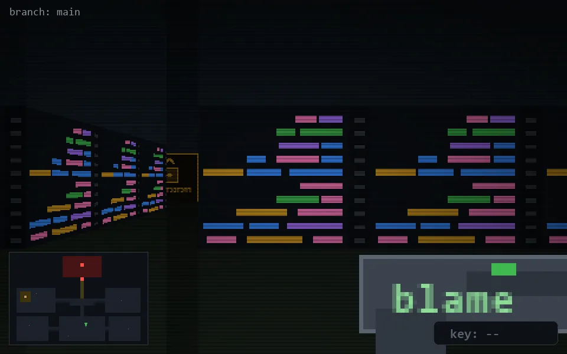

<!-- node:x21y20N -->
### `branch: main` · 📍 (21, 20) · facing N · 🔑 —

|      |      |      |
|:----:|:----:|:----:|
|      | [⬆️](x21y19N.md) |      |
| [⬅️](x21y20W.md) | [💥](x21y20Nd.md) | [➡️](x21y20E.md) |
|      | [⬇️](x21y21N.md) |      |

[⌂ index](../README.md)
