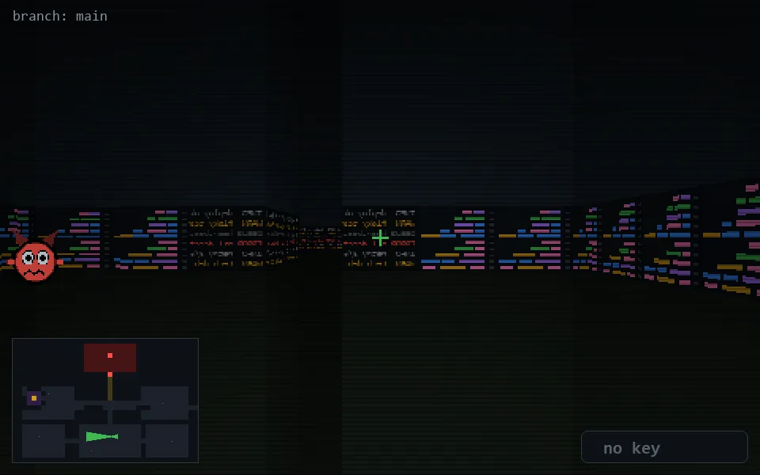

<!-- node:x21y20W -->
### `branch: main` · 📍 (21, 20) · facing W · 🔑 —

|      |      |      |
|:----:|:----:|:----:|
|      | [⬆️](x20y20W.md) |      |
| [⬅️](x21y20S.md) | [💥](x21y20Wd.md) | [➡️](x21y20N.md) |
|      | [⬇️](x22y20W.md) |      |

[⌂ index](../README.md)
